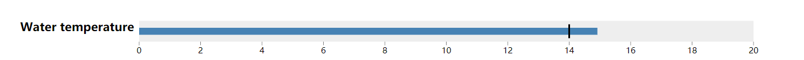

# vast2018_mc2
This is training demo for Vast Challenge 2018 mini challenge 2.  

https://soundquiet.github.io/vast2018/  

We categorize the indexes of the river into small groups.  
There are three parts of our system: **the bubble chart, multiseries line chart and bullet chart.**

### Bubble Chart
This chart represents the Physical Chemistry Index of the river for one year. The size of a bubble shows the value of one index relatively. Slider defines the year for the chart.  
### Multi-Series Line Chart
It shows the changes of one kind of indexes from 2009 to 2016 with `mouseover` event.
### Bullet Chart

- The blue center line represents the actual value of this index.  
- The black vertical line represents a standard value for water quality. In this case, annual mean water temperature in 2009 is a bit higher than standard value.  
- The colored gery bands represent ranges.  

**However**, we could not find all the standard values of every index, and there are several versions of water quality in different countries and states. So some of the index standards are zero. 
